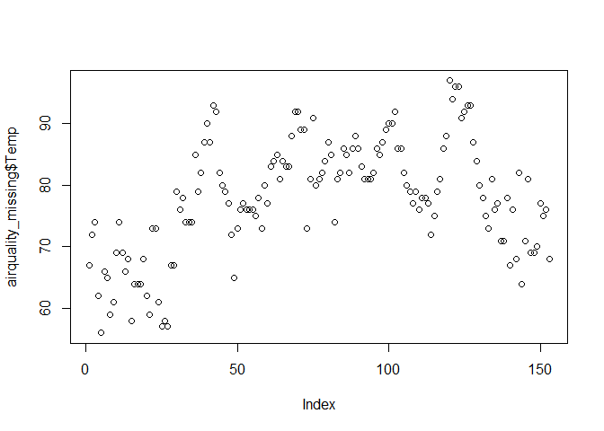
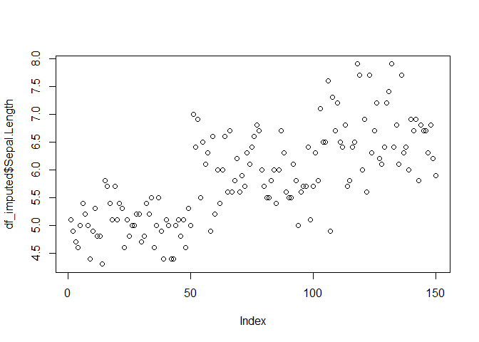
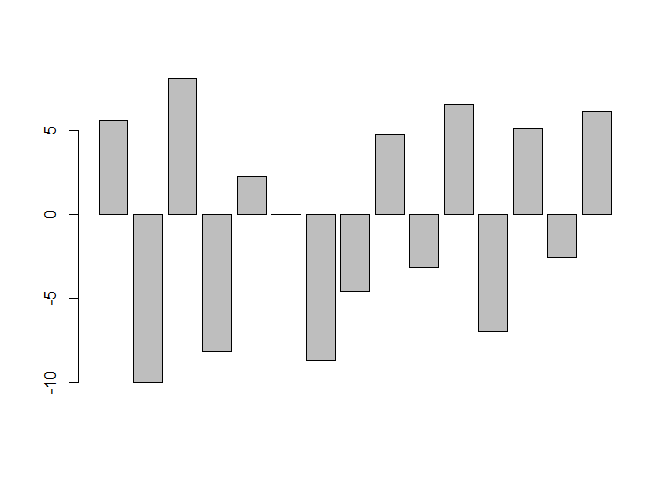

# Chapters

-   Mean imputation

-   locf and nocb

-   knn

-   Advance Imputation with MICE

-   Predictive Mean Matching

-   Random Forest

-   Downloading TCGA

-   Patient data extraction and inspection

-   Advance imputation

# Mean imputation

``` r
vec <- c(4, NA, 7, 5, 7, 1, 6, 3, NA, 5)             
mean(vec,na.rm = TRUE)
```

    ## [1] 4.75

``` r
vec[is.na(vec)] <- mean(vec[!is.na(vec)]) 
vec 
```

    ##  [1] 4.00 4.75 7.00 5.00 7.00 1.00 6.00 3.00 4.75 5.00

``` r
iris <- iris 

df_missing <- iris$Sepal.Length
df_missing[c(2,4,6,8,10)] <- NA

df_missing[is.na(df_missing)] <- mean(df_missing[!is.na(df_missing)])

meanimpute <- function(vec){
  vec[is.na(vec)] <- mean(vec[!is.na(vec)]) 
  return(vec)
}
```

``` r
iris <- iris 

df_missing <- iris$Sepal.Length
df_missing[c(2,4,6,8,10)] <- NA

df_missing <- meanimpute(df_missing)
df_missing[c(2,4,6,8,10)]
```

    ## [1] 5.873793 5.873793 5.873793 5.873793 5.873793

# locf and nocb

``` r
library(nonmemica)

locf(c(NA,1,2,NA,NA,3,NA,4,NA))
```

    ## [1] NA  1  2  2  2  3  3  4  4

``` r
nocb(c(NA,1,2,NA,NA,3,NA,4,NA))
```

    ## [1]  1  1  2  3  3  3  4  4 NA

``` r
forbak(c(NA,1,2,NA,NA,3,NA,4,NA))
```

    ## [1] 1 1 2 2 2 3 3 4 4

``` r
airquality <- data.frame(datasets::airquality)
```

``` r
removedata <- sample(1:nrow(airquality))[1:10]
airquality_missing  <- airquality 

airquality_missing$Temp[removedata] <- NA
airquality_missing$Temp <- forbak(airquality_missing$Temp)

original <- airquality$Temp[removedata]
imputed <- airquality_missing$Temp[removedata]

original <- as.numeric(original)
imputed  <- as.numeric(imputed)

plot(original,imputed)
abline(a = 1, b = 1) 
```

<!-- -->

``` r
plot(airquality$Temp)
```

<!-- -->

``` r
plot(airquality_missing$Temp)
```

<!-- -->

# KNN and KNN imputation

``` r
# how KNN works 
# KNN is a clustering algorithm, allowing the prediction of species from Sepal and petal details 

df <- iris

#the normalization function is created
nor <-function(x) { (x -min(x))/(max(x)-min(x))   }
 
##Run nomalization on first 4 coulumns of dataset because they are the predictors
df_norm <- as.data.frame(lapply(df[,c(1,2,3,4)], nor))
```

``` r
ran <- sample(1:nrow(df), 0.9 * nrow(df))
  
df_train <- df_norm[ran,] 
df_test <- df_norm[-ran,] 

df_target_category <- iris[ran,5]
df_test_category <- iris[-ran,5]

library(class)
##run knn function
predicted <- knn(df_train,df_test,cl=df_target_category,k=3)
 
##create confusion matrix
tab <- table(predicted,df_test_category)
tab
```

    ##             df_test_category
    ## predicted    setosa versicolor virginica
    ##   setosa          5          0         0
    ##   versicolor      0          4         0
    ##   virginica       0          1         5

``` r
##this function divides the correct predictions by total number of predictions that tell us how accurate teh model is.
 
accuracy <- function(x){sum(diag(x)/(sum(rowSums(x)))) * 100}
accuracy(tab)
```

    ## [1] 93.33333

# KNN Imputation

``` r
# the concept is the same, but we are clustering the other columns and filing the missing data based on the nearest neighbor in the clustering 

library(DMwR2) 
```

    ## Registered S3 method overwritten by 'quantmod':
    ##   method            from
    ##   as.zoo.data.frame zoo

``` r
ran2 <- sample(1:nrow(df), 0.1 * nrow(df))
df_missing <- df[,-5]
df_missing$Sepal.Length[ran2] <- ""

#KNN imputation
df_imputed <- knnImputation(df_missing,k=3)

tab <- c()
tab$original <- df$Sepal.Length[ran2]
tab$imputed <- as.numeric(df_imputed$Sepal.Length[ran2])
tab$diff <- tab$original - tab$imputed

plot(df$Sepal.Length)
```

<!-- -->

``` r
plot(df_imputed$Sepal.Length)
```

<!-- -->

``` r
percetange_dff <- tab$diff / tab$original * 100
barplot(percetange_dff)
```

<!-- --> ## Trying
different paramteres

``` r
for(i in 1:10) {
  df_imputed <- knnImputation(df_missing, k = i, scale = T)
  
  tab <- c()
  tab$original <- df$Sepal.Length[ran2]
  tab$imputed <- as.numeric(df_imputed$Sepal.Length[ran2])
  tab$diff <- tab$original - tab$imputed
  
  percetange_dff <- tab$diff / tab$original * 100 
  print(barplot(percetange_dff))
}
```

<!-- -->

    ##       [,1]
    ##  [1,]  0.7
    ##  [2,]  1.9
    ##  [3,]  3.1
    ##  [4,]  4.3
    ##  [5,]  5.5
    ##  [6,]  6.7
    ##  [7,]  7.9
    ##  [8,]  9.1
    ##  [9,] 10.3
    ## [10,] 11.5
    ## [11,] 12.7
    ## [12,] 13.9
    ## [13,] 15.1
    ## [14,] 16.3
    ## [15,] 17.5

    ##       [,1]
    ##  [1,]  0.7
    ##  [2,]  1.9
    ##  [3,]  3.1
    ##  [4,]  4.3
    ##  [5,]  5.5
    ##  [6,]  6.7
    ##  [7,]  7.9
    ##  [8,]  9.1
    ##  [9,] 10.3
    ## [10,] 11.5
    ## [11,] 12.7
    ## [12,] 13.9
    ## [13,] 15.1
    ## [14,] 16.3
    ## [15,] 17.5

<!-- -->

    ##       [,1]
    ##  [1,]  0.7
    ##  [2,]  1.9
    ##  [3,]  3.1
    ##  [4,]  4.3
    ##  [5,]  5.5
    ##  [6,]  6.7
    ##  [7,]  7.9
    ##  [8,]  9.1
    ##  [9,] 10.3
    ## [10,] 11.5
    ## [11,] 12.7
    ## [12,] 13.9
    ## [13,] 15.1
    ## [14,] 16.3
    ## [15,] 17.5

<!-- -->

    ##       [,1]
    ##  [1,]  0.7
    ##  [2,]  1.9
    ##  [3,]  3.1
    ##  [4,]  4.3
    ##  [5,]  5.5
    ##  [6,]  6.7
    ##  [7,]  7.9
    ##  [8,]  9.1
    ##  [9,] 10.3
    ## [10,] 11.5
    ## [11,] 12.7
    ## [12,] 13.9
    ## [13,] 15.1
    ## [14,] 16.3
    ## [15,] 17.5

<!-- -->

    ##       [,1]
    ##  [1,]  0.7
    ##  [2,]  1.9
    ##  [3,]  3.1
    ##  [4,]  4.3
    ##  [5,]  5.5
    ##  [6,]  6.7
    ##  [7,]  7.9
    ##  [8,]  9.1
    ##  [9,] 10.3
    ## [10,] 11.5
    ## [11,] 12.7
    ## [12,] 13.9
    ## [13,] 15.1
    ## [14,] 16.3
    ## [15,] 17.5

    ##       [,1]
    ##  [1,]  0.7
    ##  [2,]  1.9
    ##  [3,]  3.1
    ##  [4,]  4.3
    ##  [5,]  5.5
    ##  [6,]  6.7
    ##  [7,]  7.9
    ##  [8,]  9.1
    ##  [9,] 10.3
    ## [10,] 11.5
    ## [11,] 12.7
    ## [12,] 13.9
    ## [13,] 15.1
    ## [14,] 16.3
    ## [15,] 17.5

<!-- -->

    ##       [,1]
    ##  [1,]  0.7
    ##  [2,]  1.9
    ##  [3,]  3.1
    ##  [4,]  4.3
    ##  [5,]  5.5
    ##  [6,]  6.7
    ##  [7,]  7.9
    ##  [8,]  9.1
    ##  [9,] 10.3
    ## [10,] 11.5
    ## [11,] 12.7
    ## [12,] 13.9
    ## [13,] 15.1
    ## [14,] 16.3
    ## [15,] 17.5

<!-- -->

    ##       [,1]
    ##  [1,]  0.7
    ##  [2,]  1.9
    ##  [3,]  3.1
    ##  [4,]  4.3
    ##  [5,]  5.5
    ##  [6,]  6.7
    ##  [7,]  7.9
    ##  [8,]  9.1
    ##  [9,] 10.3
    ## [10,] 11.5
    ## [11,] 12.7
    ## [12,] 13.9
    ## [13,] 15.1
    ## [14,] 16.3
    ## [15,] 17.5

<!-- -->

    ##       [,1]
    ##  [1,]  0.7
    ##  [2,]  1.9
    ##  [3,]  3.1
    ##  [4,]  4.3
    ##  [5,]  5.5
    ##  [6,]  6.7
    ##  [7,]  7.9
    ##  [8,]  9.1
    ##  [9,] 10.3
    ## [10,] 11.5
    ## [11,] 12.7
    ## [12,] 13.9
    ## [13,] 15.1
    ## [14,] 16.3
    ## [15,] 17.5

<!-- -->

    ##       [,1]
    ##  [1,]  0.7
    ##  [2,]  1.9
    ##  [3,]  3.1
    ##  [4,]  4.3
    ##  [5,]  5.5
    ##  [6,]  6.7
    ##  [7,]  7.9
    ##  [8,]  9.1
    ##  [9,] 10.3
    ## [10,] 11.5
    ## [11,] 12.7
    ## [12,] 13.9
    ## [13,] 15.1
    ## [14,] 16.3
    ## [15,] 17.5

# Advance Data Imputation with MICE

``` r
library(mice)
```

    ## 
    ## Attaching package: 'mice'

    ## The following object is masked from 'package:nonmemica':
    ## 
    ##     pool

    ## The following object is masked from 'package:stats':
    ## 
    ##     filter

    ## The following objects are masked from 'package:base':
    ## 
    ##     cbind, rbind

``` r
data <- airquality
data[1:7,3] <- NA
data[1:5,4] <- NA

head(data)
```

    ##   Ozone Solar.R Wind Temp Month Day
    ## 1    41     190   NA   NA     5   1
    ## 2    36     118   NA   NA     5   2
    ## 3    12     149   NA   NA     5   3
    ## 4    18     313   NA   NA     5   4
    ## 5    NA      NA   NA   NA     5   5
    ## 6    28      NA   NA   66     5   6

``` r
tempData <- mice(data,m=3, maxit=50, meth='pmm', seed=500, printFlag = FALSE)

summary(tempData)
```

    ## Class: mids
    ## Number of multiple imputations:  3 
    ## Imputation methods:
    ##   Ozone Solar.R    Wind    Temp   Month     Day 
    ##   "pmm"   "pmm"   "pmm"   "pmm"      ""      "" 
    ## PredictorMatrix:
    ##         Ozone Solar.R Wind Temp Month Day
    ## Ozone       0       1    1    1     1   1
    ## Solar.R     1       0    1    1     1   1
    ## Wind        1       1    0    1     1   1
    ## Temp        1       1    1    0     1   1
    ## Month       1       1    1    1     0   1
    ## Day         1       1    1    1     1   0

``` r
imputedData <- complete(tempData,1)
```

``` r
diff_pmm <- cbind(airquality[1:7,3],imputedData[1:7,3])
diff_pmm
```

    ##      [,1] [,2]
    ## [1,]  7.4  8.6
    ## [2,]  8.0 10.9
    ## [3,] 12.6  8.0
    ## [4,] 11.5 14.3
    ## [5,] 14.3 11.5
    ## [6,] 14.9 13.8
    ## [7,]  8.6  9.7

``` r
diff2_pmm <- cbind(airquality[1:5,4], imputedData[1:5,4])
diff2_pmm
```

    ##      [,1] [,2]
    ## [1,]   67   82
    ## [2,]   72   75
    ## [3,]   74   68
    ## [4,]   62   81
    ## [5,]   56   64

# Random forest imputation

``` r
data <- airquality
data[1:7,3] <- NA
data[1:5,4] <- NA

tempData <- mice(data,m=3, maxit=50, meth='rf', seed=500, printFlag = FALSE)

imputedData <- complete(tempData,1)
```

``` r
diff_rf <- cbind(airquality[1:7,3],imputedData[1:7,3])
diff2_rf <- cbind(airquality[1:5,4], imputedData[1:5,4])
```

``` r
original <- c(airquality[1:7,3],airquality[1:5,4])
pmm <- c(diff_pmm[,2],diff2_pmm[,2])
rf <- c(diff_rf[,2],diff2_rf[,2])

pdata <- c()
pdata$ori <- original
pdata$pmm <- pmm 
pdata$rf <- rf
pdata$index <- seq(1, length(original))
pdata  <- as.data.frame(pdata)

library(ggplot2)

ggplot(pdata, aes(x=index))  + 
  geom_line(aes(y=ori), col="blue" ) + 
  geom_line(aes(y=pmm), col="red"  ) + 
  geom_line(aes(y=rf),  col="green") + 
  theme_bw()
```

<!-- -->

# Imputation of patient data in TCGA

``` r
library(TCGAbiolinks)

#Load in the data 
query_TCGA <- GDCquery(
  project = "TCGA-PRAD",
  data.category = "Transcriptome Profiling",
  data.type = "Gene Expression Quantification",
  experimental.strategy = "RNA-Seq",
  barcode = c("TCGA-CH-*")) # parameter enforced by GDCquery
```

    ## --------------------------------------

    ## o GDCquery: Searching in GDC database

    ## --------------------------------------

    ## Genome of reference: hg38

    ## --------------------------------------------

    ## oo Accessing GDC. This might take a while...

    ## --------------------------------------------

    ## ooo Project: TCGA-PRAD

    ## --------------------

    ## oo Filtering results

    ## --------------------

    ## ooo By experimental.strategy

    ## ooo By data.type

    ## ooo By barcode

    ## ----------------

    ## oo Checking data

    ## ----------------

    ## ooo Check if there are duplicated cases

    ## ooo Check if there results for the query

    ## -------------------

    ## o Preparing output

    ## -------------------

``` r
# https://portal.gdc.cancer.gov/projects/TCGA-PRAD

GDCdownload(query = query_TCGA, method = "api", files.per.chunk = 100)
```

    ## Downloading data for project TCGA-PRAD

    ## Of the 36 files for download 36 already exist.

    ## All samples have been already downloaded

``` r
tcga_data <- GDCprepare(query_TCGA,summarizedExperiment = TRUE)
```

    ## |                                                    |  0%                      |=                                                   |2.777778% ~16 s remaining |==                                                  |5.555556% ~9 s remaining  |====                                                |8.333333% ~7 s remaining  |=====                                               |11.11111% ~6 s remaining  |=======                                             |13.88889% ~5 s remaining  |========                                            |16.66667% ~7 s remaining  |==========                                          |19.44444% ~6 s remaining  |===========                                         |22.22222% ~6 s remaining  |=============                                       | 25% ~5 s remaining       |==============                                      |27.77778% ~5 s remaining  |===============                                     |30.55556% ~4 s remaining  |=================                                   |33.33333% ~4 s remaining  |==================                                  |36.11111% ~4 s remaining  |====================                                |38.88889% ~3 s remaining  |=====================                               |41.66667% ~3 s remaining  |=======================                             |44.44444% ~4 s remaining  |========================                            |47.22222% ~3 s remaining  |==========================                          | 50% ~3 s remaining       |===========================                         |52.77778% ~3 s remaining  |============================                        |55.55556% ~3 s remaining  |==============================                      |58.33333% ~2 s remaining  |===============================                     |61.11111% ~2 s remaining  |=================================                   |63.88889% ~2 s remaining  |==================================                  |66.66667% ~2 s remaining  |====================================                |69.44444% ~2 s remaining  |=====================================               |72.22222% ~1 s remaining  |=======================================             | 75% ~1 s remaining       |========================================            |77.77778% ~1 s remaining  |=========================================           |80.55556% ~1 s remaining  |===========================================         |83.33333% ~1 s remaining  |============================================        |86.11111% ~1 s remaining  |==============================================      |88.88889% ~1 s remaining  |===============================================     |91.66667% ~0 s remaining  |=================================================   |94.44444% ~0 s remaining  |==================================================  |97.22222% ~0 s remaining  |====================================================|100% ~0 s remaining       |====================================================|100%                      Completed after 5 s

    ## Starting to add information to samples

    ##  => Add clinical information to samples

    ##  => Adding TCGA molecular information from marker papers

    ##  => Information will have prefix 'paper_'

    ## prad subtype information from:doi:10.1016/j.cell.2015.10.025

    ## Available assays in SummarizedExperiment : 
    ##   => unstranded
    ##   => stranded_first
    ##   => stranded_second
    ##   => fpkm_unstrand
    ##   => tpm_unstrand

``` r
class(tcga_data)
```

    ## [1] "RangedSummarizedExperiment"
    ## attr(,"package")
    ## [1] "SummarizedExperiment"

``` r
saveRDS(tcga_data,file = "TCGA.rds")
tcga_data <- readRDS("TCGA.rds")
```

``` r
library(mice)
rawdata <- as.data.frame(tcga_data@assays@data$tpm_unstrand)
#rawdata <- rawdata[,-c(1,2)]
rawdata <- log10(rawdata+1)
rawdata <- rawdata[!rowSums(rawdata)<10,]
rawdata <- rawdata[1:1000,]

ran2 <- sample(1:nrow(rawdata), 0.20 * nrow(rawdata))

missing_data <- rawdata 
missing_data[ran2,1] <- NA
```

``` r
tempData <- mice(missing_data,m=3, maxit=50, meth='rf', seed=500, printFlag = FALSE)
```

    ## Warning: Number of logged events: 150

``` r
#RandomForest

imputed_data_1 <- complete(tempData,1)
```

``` r
library(mice)
tempData <- mice(missing_data, m=3, maxit=50, meth='lasso.select.norm', seed=500, printFlag = FALSE)
```

    ## Warning: Number of logged events: 150

``` r
#Lasso select + linear regression

imputed_data_2 <- complete(tempData,1)
```

``` r
original <- rawdata[, 1]
imputed1 <- imputed_data_1[, 1]
imputed2 <- imputed_data_2[, 1]

pdata <- c()
pdata$ori <- original
pdata$imp1 <- imputed1
pdata$imp2 <- imputed2
pdata$index <- seq(1, length(original))
pdata  <- as.data.frame(pdata)

pdata <- pdata[ran2, ]

library(ggplot2)

ggplot(pdata, aes(x = index))  +
  geom_line(aes(y = ori), col = "blue") +
  geom_line(aes(y = imp1), col = "red") +
  geom_line(aes(y = imp2),  col = "green") +
  theme_bw() +
  scale_y_log10()
```

<!-- -->

# Residual plot

``` r
pdata$resi_imp1 <- (pdata$ori - pdata$imp1)/pdata$ori 
pdata$resi_imp2 <- (pdata$ori - pdata$imp2)/pdata$ori 

ggplot(pdata, aes(x=ori))  + 
  geom_line(aes(y=resi_imp1), col="red"  ) + 
  geom_line(aes(y=resi_imp2),  col="green") + 
  theme_bw() + 
  scale_x_log10() + 
  ylab("Residual") + 
  xlab("Count No")
```

<!-- -->
